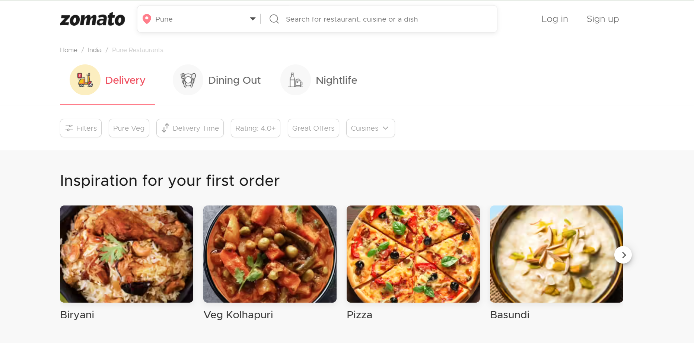
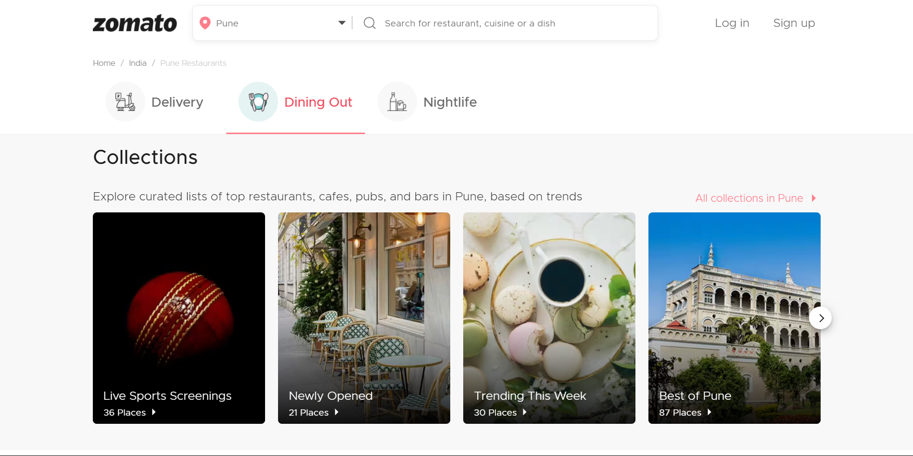
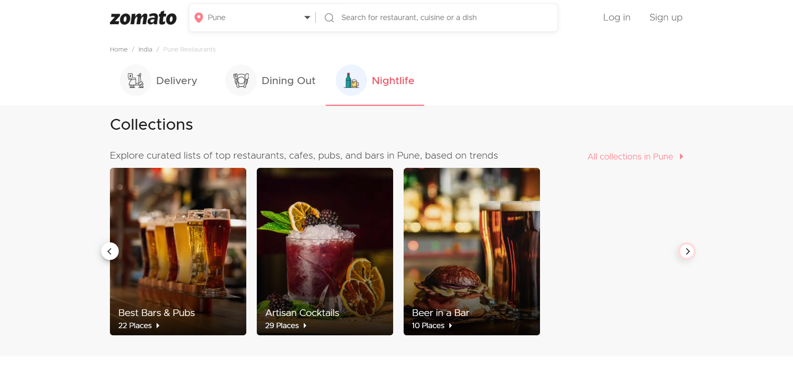
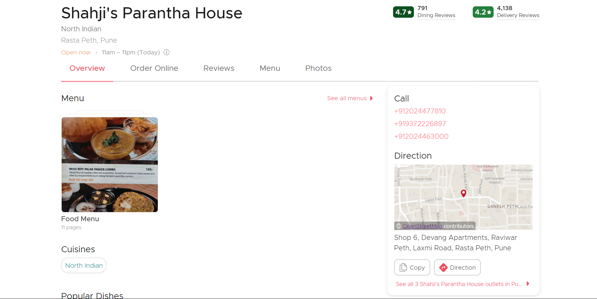
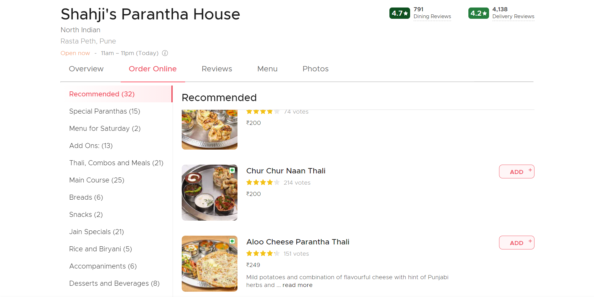
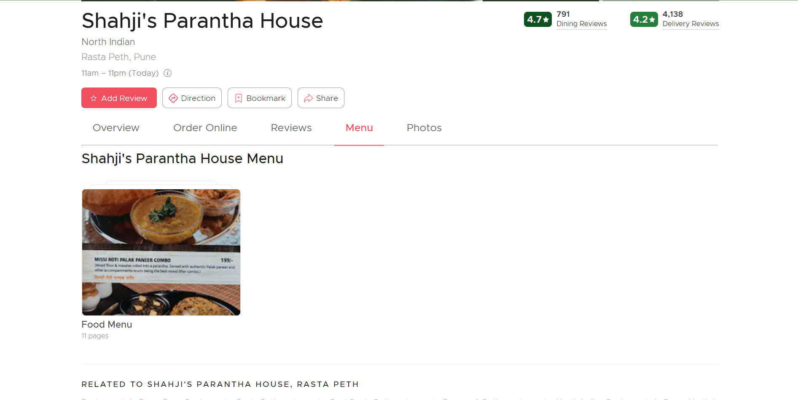
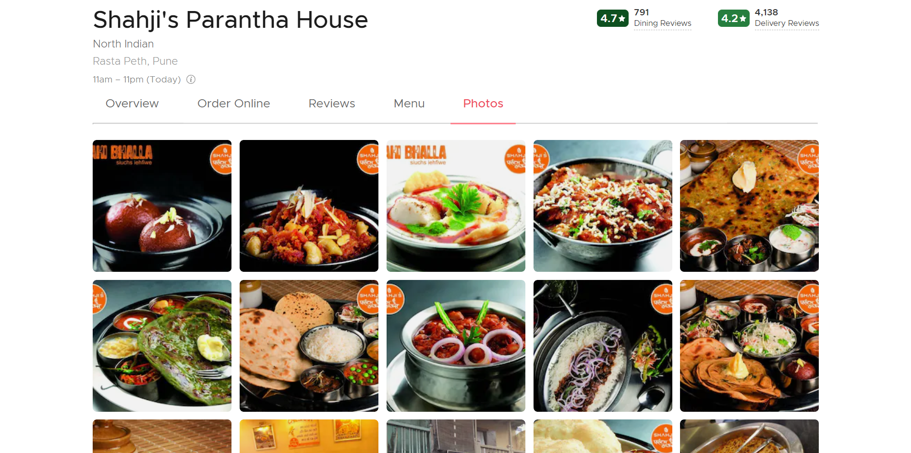
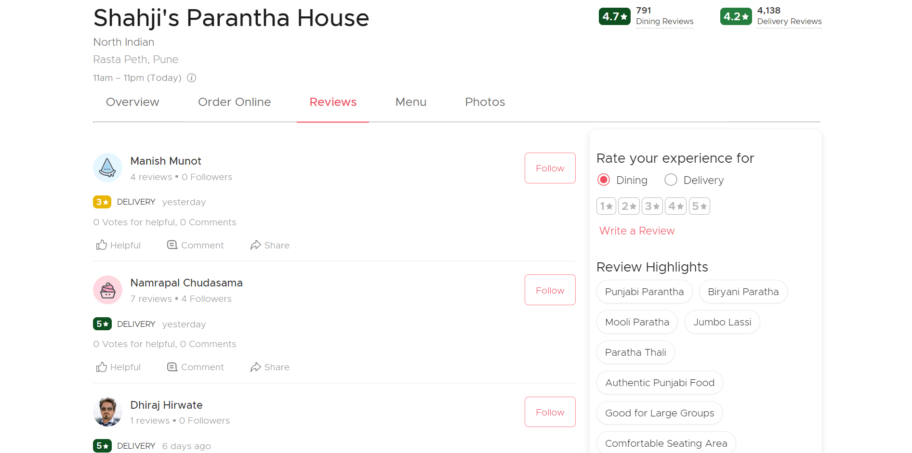

# `Zomato Clone(tomato)`

In the project directory, A End to End clone of [zomato](https://www.zomato.com/) is made. User can order food online , search for popular restaurants, search for restaurants located nearby, can sort the items by popularity-high to low, delivery rating and can also filter item according to cuisines, cost and ratings. User have to `sign in` or `sign up` before checkout and make payments.

User can `sign in` or `sign up` using `google sign in` or through `email verification`.

#### Project Screenshots

<table>
   <tr align=center>
     <td  colspan=3>Landing Page </td>
  </tr>
  <tr>
    <td>Dining Page </td>
    <td>NightLife Page </td>
    <td>Restaurant Update Page</td>
  <tr>
   <td>Overview Page</td>
     <td>Order-Online Page</td>
   <td>Menu Page</td>
   <tr>
   <td>Photos Page</td>
     <td>Reviews Page</td>
  
  </tr>
</table>

## Built With

`MERN stack`

### `Functionalities`

- User can order food online based on location
- OAuth login through google
- Google Maps Integrated
- RazorPay Integrated for Payment
- Similar properties suggestion feature

### `Installation and Setup Instructions`

Clone down this repository. You will need `node` and `npm` installed globally on your machine.
Installation:
`npm install`
To Run Test Suite:
`npm test`
To Start Server:
`npm start`

## `Tools Used`

#### FRONTEND

- `React`
  To learn React, check out the [React documentation](https://reactjs.org/).
- `Redux`
  To learn Redux, check out the [Redux documentation](https://redux.js.org/).
- `Tailwand`

### INTEGRATION

- `Google place autocomplete`
- `Google maps api`
- `Razor Pay`

#### BACKEND

- `npm install`
- `nodemon server.js`

### `Deployement`

deployement tool used: AWS(Amazon Web Services)
